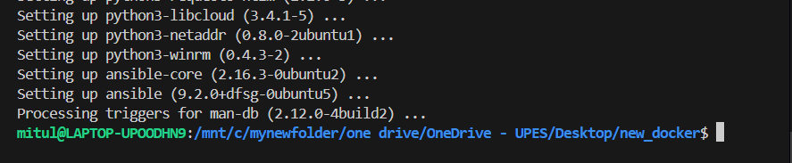
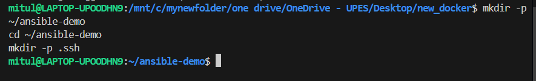
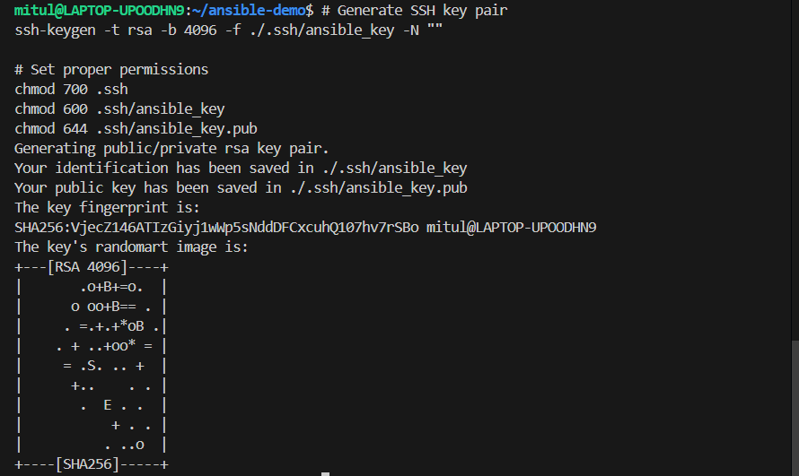
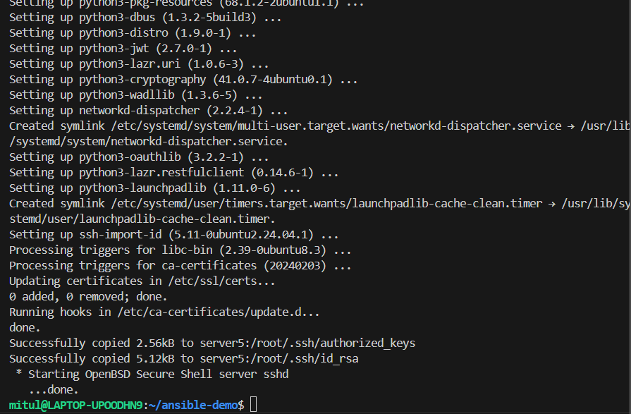
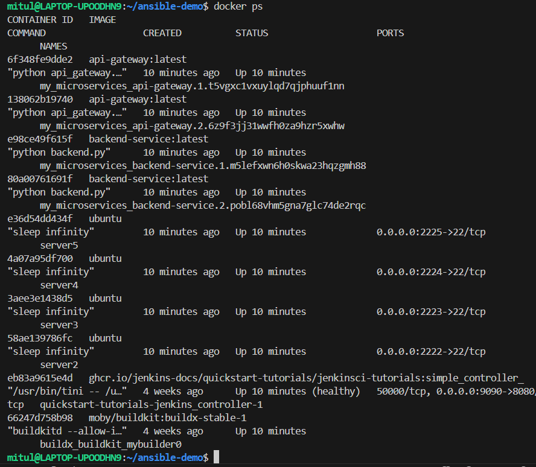
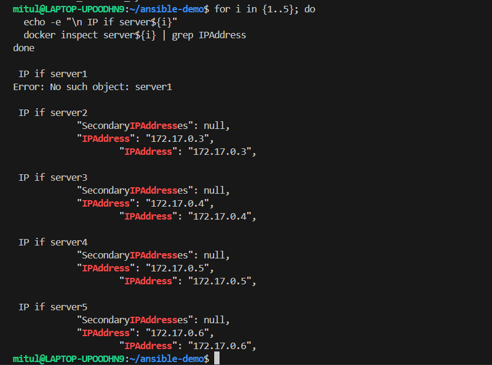
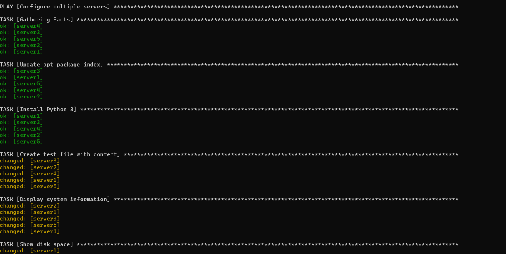
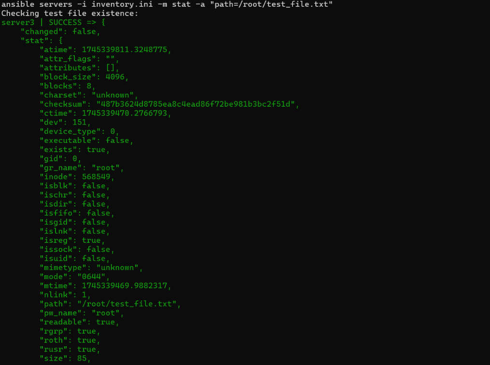

# Ansible Demo with Docker

Created by Mitul Tandon | SAP- 500105734

This project demonstrates how to use Ansible to manage multiple Docker containers as target servers. It showcases Ansible's ability to automate server configuration and management across multiple hosts.

## Table of Contents

-   [Block Diagram](#block-diagram)
-   [Setup Instructions](#setup-instructions)
-   [Verification](#verification)
-   [Cleanup](#cleanup)
-   [Troubleshooting](#troubleshooting)

## Block Diagram

```
+------------------+     +------------------+     +------------------+
|                  |     |                  |     |                  |
|  WSL2 (Control   |     |  Docker Desktop  |     |  Docker          |
|   Node)          |     |                  |     |  Containers      |
|                  |     |                  |     |                  |
|  +------------+  |     |  +------------+  |     |  +------------+  |
|  |            |  |     |  |            |  |     |  |            |  |
|  |  Ansible   |  |     |  |  Docker    |  |     |  |  Server1   |  |
|  |  Playbook  |  |     |  |  Engine    |  |     |  |  (2221)    |  |
|  |            |  |     |  |            |  |     |  |            |  |
|  +------------+  |     |  +------------+  |     |  +------------+  |
|        |         |     |        |         |     |        |         |
|  +------------+  |     |  +------------+  |     |  +------------+  |
|  |            |  |     |  |            |  |     |  |            |  |
|  |  SSH Keys  |  |     |  |  Port      |  |     |  |  Server2   |  |
|  |            |  |     |  |  Mapping   |  |     |  |  (2222)    |  |
|  +------------+  |     |  +------------+  |     |  +------------+  |
|        |         |     |        |         |     |        |         |
|  +------------+  |     |  +------------+  |     |  +------------+  |
|  |            |  |     |  |            |  |     |  |            |  |
|  | Inventory  |  |     |  |  Network   |  |     |  |  Server3   |  |
|  | File       |  |     |  |  Bridge    |  |     |  |  (2223)    |  |
|  +------------+  |     |  +------------+  |     |  +------------+  |
|        |         |     |        |         |     |        |         |
+--------|---------+     +--------|---------+     +--------|---------+
         |                        |                        |
         |                        |                        |
         |                        |                        |
         +------------------------+------------------------+
                                  |
                                  v
                           +------------+
                           |            |
                           |  SSH       |
                           |  Protocol  |
                           |            |
                           +------------+
```

### Component Description

1. **WSL2 (Control Node)**

    - Runs Ansible playbook
    - Manages SSH keys
    - Contains inventory file
    - Executes commands

2. **Docker Desktop**

    - Manages container lifecycle
    - Handles port mapping
    - Provides network bridge
    - Manages container resources

3. **Docker Containers**

    - Run Ubuntu OS
    - Expose SSH ports
    - Execute Ansible tasks
    - Maintain consistent state

4. **SSH Protocol**
    - Secure communication
    - Key-based authentication
    - Port forwarding
    - Remote command execution

### Data Flow

1. Ansible playbook is executed on WSL2
2. SSH keys are used for authentication
3. Commands are sent through Docker's port mapping
4. Containers execute commands and return results
5. Ansible processes results and continues workflow

## Setup Instructions

### 1. Install Required Software

In WSL2, install Ansible and SSH client, and docker integration with WSL distros:

```bash
wsl --install
sudo apt update
sudo apt install -y ansible openssh-client
```




### 2. Create Project Directory

```bash
mkdir -p ~/ansible-demo
cd ~/ansible-demo
mkdir -p .ssh
```



### 3. Generate SSH Keys

```bash
# Generate SSH key pair
ssh-keygen -t rsa -b 4096 -f ./.ssh/ansible_key -N ""

# Set proper permissions
chmod 700 .ssh
chmod 600 .ssh/ansible_key
chmod 644 .ssh/ansible_key.pub
```



### 4. Create Docker Containers

```bash
# Create 5 Ubuntu containers with SSH port mapping
for i in {1..5}; do
    docker run -d \
        --name server$i \
        -p 222$i:22 \
        ubuntu sleep infinity
done

# Install required packages and configure SSH
for i in {1..5}; do
    # Install packages
    docker exec server$i bash -c "apt-get update && apt-get install -y openssh-server python3"

    # Configure SSH
    docker exec server$i bash -c "mkdir -p /root/.ssh"
    docker exec server$i bash -c "echo 'PermitRootLogin yes' >> /etc/ssh/sshd_config"
    docker exec server$i bash -c "echo 'PubkeyAuthentication yes' >> /etc/ssh/sshd_config"
    docker exec server$i bash -c "echo 'PasswordAuthentication no' >> /etc/ssh/sshd_config"

    # Copy SSH keys
    docker cp ./.ssh/ansible_key.pub server$i:/root/.ssh/authorized_keys
    docker cp ./.ssh/ansible_key server$i:/root/.ssh/id_rsa

    # Set proper permissions and ownership
    docker exec server$i bash -c "chown -R root:root /root/.ssh"
    docker exec server$i bash -c "chmod 700 /root/.ssh"
    docker exec server$i bash -c "chmod 600 /root/.ssh/id_rsa"
    docker exec server$i bash -c "chmod 644 /root/.ssh/authorized_keys"

    # Start SSH service
    docker exec server$i bash -c "service ssh start"
done
```



### 5. Verify containers are up and running:

```bash
docker ps
```



### 6. Find IP of docker containers (optional ps~ we wont use this because of port mapping):

```bash
for i in {1..5}; do
  echo -e "\n IP if server${i}"
  docker inspect server${i} | grep IPAddress
done
```



### 7. Create Inventory File in the current directory

Create `inventory.ini`:

```ini
[servers]
server1 ansible_host=localhost ansible_port=2221
server2 ansible_host=localhost ansible_port=2222
server3 ansible_host=localhost ansible_port=2223
server4 ansible_host=localhost ansible_port=2224
server5 ansible_host=localhost ansible_port=2225

[servers:vars]
ansible_user=root
ansible_ssh_private_key_file=./.ssh/ansible_key
ansible_python_interpreter=/usr/bin/python3
ansible_ssh_common_args='-o StrictHostKeyChecking=no'
```


### 8. Create Ansible Playbook in the current directory

Create `playbook.yml`:

```yaml
---
- name: Configure multiple servers
  hosts: servers
  become: yes

  tasks:
      - name: Update apt package index
        apt:
            update_cache: yes

      - name: Install Python 3
        apt:
            name: python3
            state: latest

      - name: Create test file with content
        copy:
            dest: /root/test_file.txt
            content: |
                This is a test file created by Ansible
                Server name: {{ inventory_hostname }}
                Current date: {{ ansible_date_time.date }}

      - name: Display system information
        command: uname -a
        register: uname_output

      - name: Show disk space
        command: df -h
        register: disk_space

      - name: Print results
        debug:
            msg:
                - "System info: {{ uname_output.stdout }}"
                - "Disk space: {{ disk_space.stdout_lines }}"
```


### 9. Run Ansible Playbook

```bash
ansible-playbook -i inventory.ini playbook.yml
```




## Verification

### Manual Verification

```bash
# Check Python version
for i in {1..5}; do
    echo "Python version on server$i:"
    docker exec server$i python3 --version
done

# Verify test file creation
for i in {1..5}; do
    echo "Contents on server$i:"
    docker exec server$i cat /root/test_file.txt
done

# Check system information
for i in {1..5}; do
    echo "System info for server$i:"
    docker exec server$i uname -a
done

# Verify disk space
for i in {1..5}; do
    echo "Disk space on server$i:"
    docker exec server$i df -h
done
```


### Ansible Verification

```bash
# Check file existence
ansible servers -i inventory.ini -m stat -a "path=/root/test_file.txt"

# Check Python version
ansible servers -i inventory.ini -m command -a "python3 --version"
```



## Cleanup

To clean up the environment:

```bash
# Stop and remove containers
for i in {1..5}; do
    docker stop server$i
    docker rm server$i
done

# Remove SSH keys
rm -rf .ssh
```


## Troubleshooting

### Common Issues and Solutions

1. **SSH Connection Issues**

    - Problem: Permission denied (publickey)
    - Solution: Ensure proper ownership and permissions of SSH keys

    ```bash
    docker exec server1 bash -c "chown -R root:root /root/.ssh"
    docker exec server1 bash -c "chmod 700 /root/.ssh"
    docker exec server1 bash -c "chmod 600 /root/.ssh/id_rsa"
    docker exec server1 bash -c "chmod 644 /root/.ssh/authorized_keys"
    ```

2. **SSH Service Not Running**

    - Problem: Connection refused
    - Solution: Start SSH service

    ```bash
    docker exec server1 service ssh start
    ```

3. **Permission Issues**
    - Problem: Cannot access files
    - Solution: Set proper permissions
    ```bash
    chmod 700 .ssh
    chmod 600 .ssh/ansible_key
    chmod 644 .ssh/ansible_key.pub
    ```
